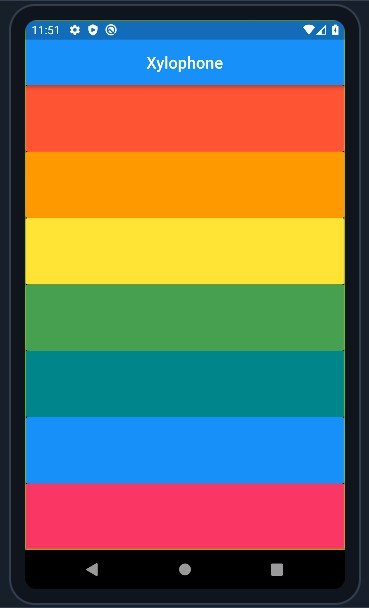

<h1 align="center"> flutter-04-xylophone</h1>

## The App



# Let's add CI / CD in this project

## What is GitHub Actions?

GitHub Actions is a continuous integration and continuous delivery (CI/CD) platform that allows you to automate your build, test, and deployment pipeline.  

## What is CI/CD?

CI/CD stands for Continuous Integration and Continuous Delivery. It is a set of practices that allow development teams to deliver software faster and more reliably. CI/CD involves automating the build, test, and deployment processes, so that code changes can be automatically integrated into the main branch and deployed to production. This helps to reduce the risk of errors and improve the quality of software.

## How to use GitHub Actions to build and release Flutter app?

1. Create a `.github/workflows` folder in the project repository
2. inside it, make a file named `main.yml`
    > This workflow file will define the steps that GitHub Actions will take to build and release the app.
3. write the following code inside main.yml:

    ```yml
    on:
      push:
        branches:
          - main
          - master
    name: "Build & Release"
    jobs:
      build:
        name: Build & Release
        runs-on: ubuntu-latest
        steps:
          - uses: actions/checkout@v3

          - uses: actions/setup-java@v3
            with:
              distribution: 'zulu'
              java-version: '12'
          - uses: subosito/flutter-action@v2
            with:
              channel: 'stable'
              architecture: x64

          - run: flutter build apk --release
          
          - name: Push to Releases
            uses: ncipollo/release-action@v1
            with:
              artifacts: "build/app/outputs/apk/release/*"
              tag: v1.0.${{ github.run_number }}
              token: ${{ secrets.TOKEN }}
    ```
4. Steps to generate TOKEN: 

    1. Generate a personal access token (PAT)

        - Go to your GitHub settings: https://github.com/settings/tokens
        - Click on "Generate new token".
        - Give your token a descriptive name, such as "GitHub Actions".
        - Select the "repo" scope.
        - Click on "Generate token".

    2. Store the token as a GitHub secret

        - Go to your repository's settings: https://github.com/{your-username}/{your-repository}/settings
        - Click on "Secrets" in the left sidebar.
        - Click on "New secret".
        - Enter "TOKEN" as the name of the secret.
        - Paste the PAT you generated in step 1 into the value field.
        - Click on "Add secret".

5. Use the token in your GitHub Actions workflow

## Use function to generate multiple TextButton (vvi):

  ```dart
  void playSound(int soundNo) {
    final player = AudioPlayer();
    player.play(AssetSource('note$soundNo.wav'));
  }

  Expanded giveButton({soundNo,colorName}) {
    return Expanded(
      child: TextButton(
        onPressed: () {
          playSound(soundNo);
        },
        style: ButtonStyle(
          backgroundColor: MaterialStateProperty.all<Color>(colorName),
        ),
        child: const Text(""),
      ),
    );
  }
  ```
  ```dart
  Column(
    crossAxisAlignment: CrossAxisAlignment.stretch,
    children: [
      giveButton(soundNo: 1, colorName: Colors.red),
      giveButton(soundNo: 2, colorName: Colors.orange),
      giveButton(soundNo: 3, colorName: Colors.yellow),
      giveButton(soundNo: 4, colorName: Colors.green),
      giveButton(soundNo: 5, colorName: Colors.teal),
      giveButton(soundNo: 6, colorName: Colors.blue),
      giveButton(soundNo: 7, colorName: Colors.pink),
    ],
  )
  ```